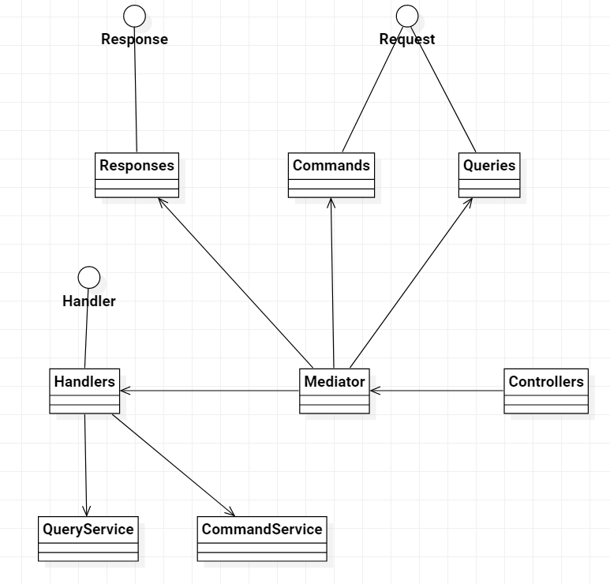
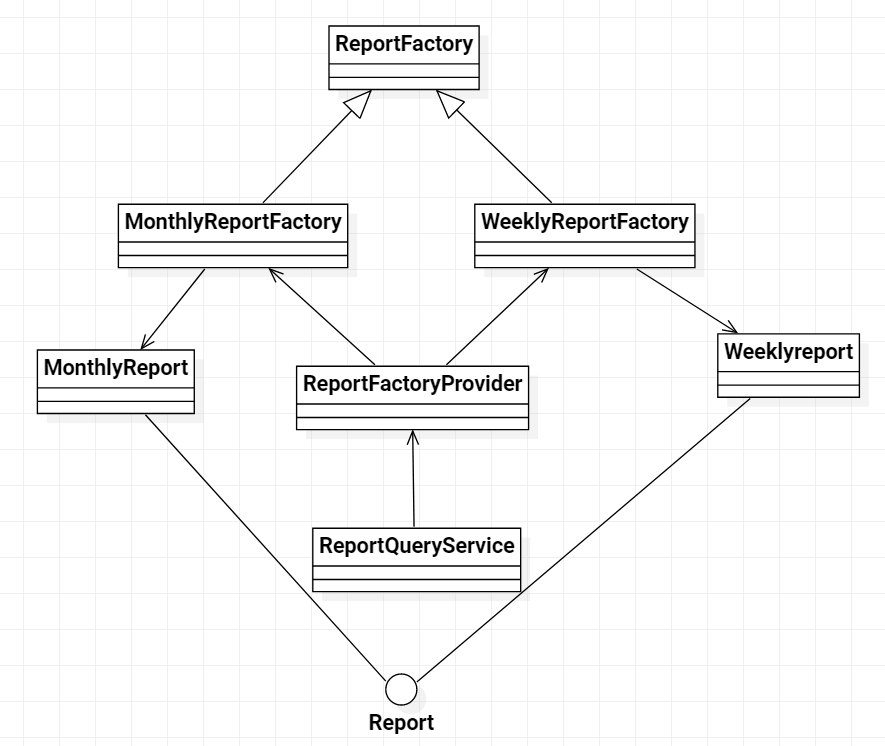

# WasteLess

## Spring + Android application that enables users to keep track of food waste.

Implemented using Spring Boot and Android (Kotlin and Retrofit).

Design patterns used:
- **CQRS** for separating data reads and writes
- **Mediator** for decoupling controllers from services
- **Abstract Factory** for creating different report types

## Architecture

## Reports

